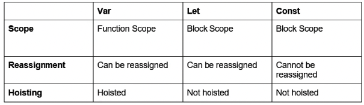

# Software Requirements
- WebStorm IDE (https://www.jetbrains.com/es-es/webstorm/)
- Node.js and Node Package Manager (npm) (https://nodejs.org/es/)
# Helpers
## 1_variables
To understand the different keywords in more detail, refer to the following table:

Figure 1.1: Differences between var, let, and const

## 2_arrowFunction
Arrow function syntax can also vary, depending on several factors. Syntax can vary slightly depending on the number of arguments passed in to the function, and the number of lines of code in the function body. The special syntax conditions are outlined briefly in the following list:
- Single input argument
- No input arguments
- Single line function body
- Single expression broken over multiple lines
- Object literal return value
